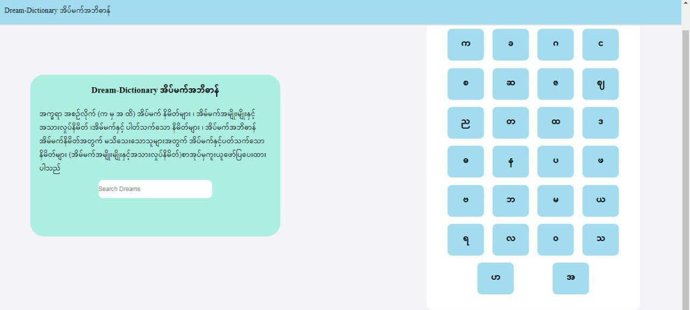
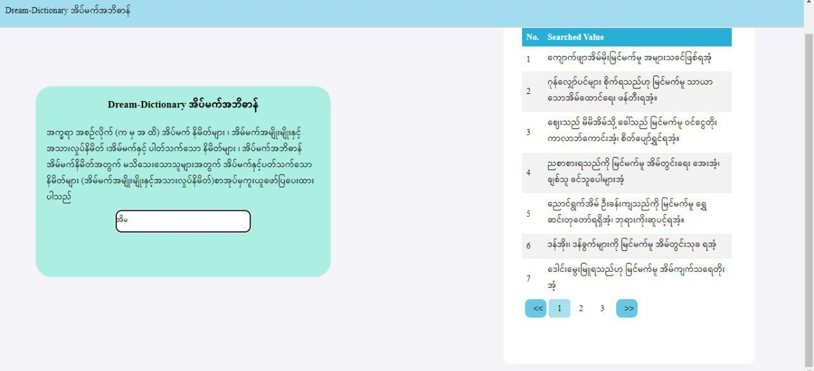
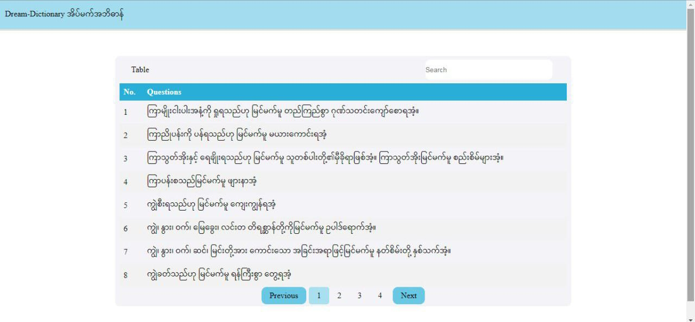
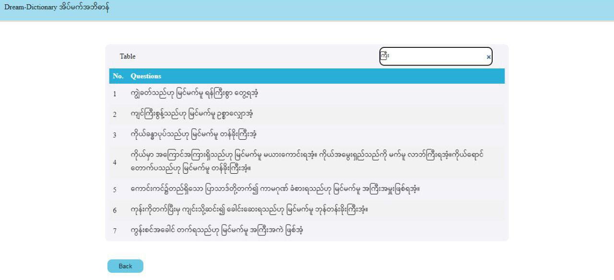

# Dream Dictionary 🌙

Explore the fascinating world of dreams with our Dream Dictionary! 📚✨

- Click on each alphabet to navigate to the dream details. 🚀
- Utilize the search input to find specific dream details. 🔍
- Enjoy seamless pagination on both the home page and dream detail page. 📖🔄

This project is developed using **ReactJS** and **Supabase** . 🚀🛠️

## Project Screenshots 📸

1. **Home Screen** 🏡
   
   *Welcome to the Dream Dictionary home screen!*

2. **Home Search Screen** 🔍🏡
   
   *Explore dream details easily with search functionality!*

3. **Dreams List** 📚✨
   
   *Browse through a curated list of dreams details.*

4. **Dreams List Search Page** 🔍📚
   
   *Effortlessly find specific dreams with search feature!*

## Credit 💡

This project idea comes from [@sannlynnhtun-coding](https://github.com/sannlynnhtun-coding). 🙌

Special Thanks 🌟 to [@sannlynnhtun-coding](https://github.com/sannlynnhtun-coding) for the inspiration and project concept!

The JSON data can be found at [Dream-Dictionary](https://github.com/sannlynnhtun-coding/Dream-Dictionary), where you can try it out for yourself! 🚀
